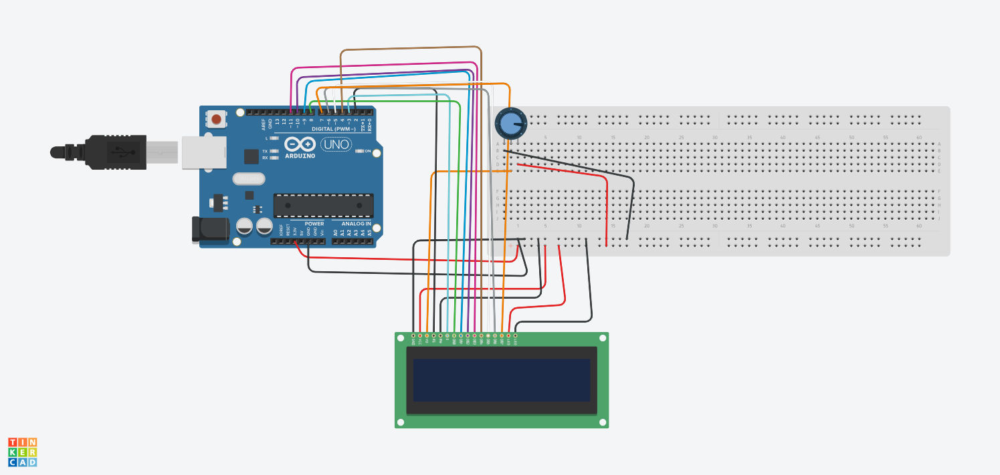

# ESP8266 WiFi Portable Box

## Overview
This project is a portable IoT box powered by an ESP8266 WiFi module, designed to display real-time data from a ThingSpeak channel on an LCD screen. The device is optimized for low power consumption and housed in a custom 3D-printed case.

## Features
- Displays live data via an LCD screen
- Battery-powered with deep sleep functionality
- Custom 3D-printed case
- Built-in button for power control

## Technology Stack
- **Hardware**: ESP8266, LCD display, button, battery pack
- **Software**: Arduino IDE, ThingSpeak API

## Setup Instructions
### Hardware Setup
1. Connect the ESP8266 to the LCD display and button as shown in the wiring diagram.
2. Since Tinkercad doesn't have ESP model, I used an arduino uno as a replacement.
3. Adjust the Potentiometer to the right setting.
make sure it's powered by 3.3V, not 5V. 

### Software Setup
1. Install the necessary libraries in the Arduino IDE:
   - `ESP8266WiFi`
   - `ThingSpeak`

## Photos

## Challenges & Learnings
I encountered some challenges with power management, and through this project, I learned about optimizing IoT devices for battery usage. A major challenge was finding a way to use the LCD display without the backpack. A backpack would make the design and wiring a lot easier.

## Future Improvements
- Add more sensors to track additional data
- Improve the LCD display readability in sunlight
